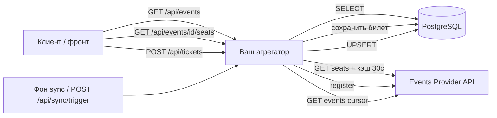

# Сервис-агрегатор Events Provider API v1.0

## Схема Read-path / write-path

```mermaid
flowchart LR
  Client[Клиент / фронт]
  Agg[Ваш агрегатор]
  DB[(PostgreSQL)]
  Prov[Events Provider API]

  Client -->|GET /api/events| Agg
  Agg -->|SELECT| DB

  Client -->|GET /api/events/id/seats| Agg
  Agg -->|GET seats + кэш 30с| Prov

  Client -->|POST /api/tickets| Agg
  Agg -->|register| Prov
  Agg -->|сохранить билет| DB

  Worker[Фон sync / POST /api/sync/trigger]
  Worker --> Agg
  Agg -->|GET events cursor| Prov
  Agg -->|UPSERT| DB
```