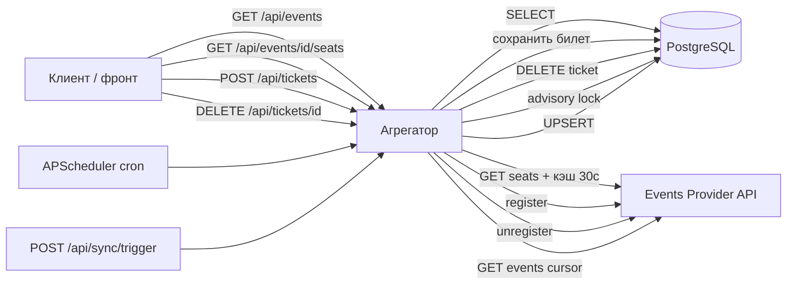

# Events API Aggregator Service

Backend-сервис-агрегатор для [Events Provider API](http://events-provider.dev-2.python-labs.ru). Кэширует события в PostgreSQL, проксирует регистрации и места к провайдеру.

## Структура API

Роуты вынесены в `app/api/v1/`:

```
app/api/v1/
├── health.py    # GET /api/health
├── events.py    # GET /api/events, GET /api/events/{event_id}, GET .../seats
├── tickets.py   # POST /api/tickets, DELETE /api/tickets/{ticket_id}
├── sync.py      # POST /api/sync/trigger
└── router.py    # сборка v1-роутеров
```

Точка входа: `app/main.py` (`create_app`, `lifespan`, middleware).

Интеграция с Events Provider: `app/integrations/events_provider/` (HTTP-клиент, схемы провайдера).

## Endpoints (текущее состояние)

| Метод | Путь | Описание |
|-------|------|----------|
| GET | `/api/health` | Проверка доступности сервиса |
| GET | `/api/events` | Список событий из БД (`date_from`, `page`, `page_size`) |
| GET | `/api/events/{event_id}` | Детали события с полной информацией о площадке |
| GET | `/api/events/{event_id}/seats` | Свободные места (провайдер + кэш `SEATS_CACHE_TTL_SECONDS`) |
| POST | `/api/tickets` | Регистрация на событие (провайдер + запись в `tickets`, сброс кэша мест) |
| DELETE | `/api/tickets/{ticket_id}` | Отмена билета → `{"success": true}` (провайдер + удаление из `tickets`, сброс кэша мест) |
| POST | `/api/sync/trigger` | Ручной запуск синхронизации с Events Provider (409, если sync уже идёт) |

Swagger UI: `/docs`

## Синхронизация событий

События попадают в PostgreSQL двумя способами:

| Способ | Когда |
|--------|--------|
| **Cron** | Каждый день в `SYNC_CRON_HOUR:SYNC_CRON_MINUTE` (`SYNC_CRON_TIMEZONE`, по умолчанию 03:00 UTC) |
| **POST /api/sync/trigger** | Вручную или автотесты LMS |

Оба пути используют `run_sync_with_lock` и **PostgreSQL advisory lock** (`pg_try_advisory_lock`) — при нескольких pod'ах в k8s sync выполняет только один процесс. Остальные cron-запуски пропускаются с записью в лог; повторный trigger возвращает **409** `sync_already_running`.

Отключить фоновый cron: `SYNC_CRON_ENABLED=false` (остаётся только ручной trigger).

## Локальный запуск

```bash
cp .env.example .env
uv sync --group dev
uv run uvicorn app.main:app --reload
```

- Health: http://localhost:8000/api/health
- Events: http://localhost:8000/api/events?page=1&page_size=20
- Docs: http://localhost:8000/docs

## Тесты и линтер

### Локально (PostgreSQL через Docker)

```bash
docker compose up -d db
uv sync --group dev
uv run alembic upgrade head
uv run ruff check .
uv run pytest -q
```

Ожидание: **60 passed** (интеграционные тесты подключаются к `localhost:5432`).

### Все тесты в Docker-контейнере

```bash
docker compose build app
docker compose up -d db
docker compose --profile test run --rm test
```

Сервис `test` применяет миграции, ставит dev-зависимости и запускает pytest с `POSTGRES_HOST=db`.

Линтер в контейнере:

```bash
docker compose run --rm --entrypoint="" app sh -c "uv sync --group dev && uv run ruff check ."
```

## Переменные окружения

См. `.env.example`. Ключевые группы:

- `LOG_*` — формат и вывод логов
- `POSTGRES_*` — PostgreSQL (шаг 2; на LMS задаёт платформа)
- `EVENTS_PROVIDER_*` — URL и API-ключ провайдера
- `SEATS_CACHE_TTL_SECONDS` — TTL in-memory кэша свободных мест (по умолчанию 30)
- `SYNC_CRON_*` — фоновая синхронизация (APScheduler в `lifespan`):

| Переменная | По умолчанию | Описание |
|------------|--------------|----------|
| `SYNC_CRON_ENABLED` | `true` | Включить ежедневный cron |
| `SYNC_CRON_HOUR` | `3` | Час запуска |
| `SYNC_CRON_MINUTE` | `0` | Минута запуска |
| `SYNC_CRON_TIMEZONE` | `UTC` | Таймзона расписания |

**LMS:** для агрегатора в кластере задайте внутренний URL провайдера:

`http://student-system-events-provider-web.student-system-events-provider.svc:8000`

Локально — публичный `http://events-provider.dev-2.python-labs.ru`.

## CI/CD

Push в `main` → GitHub Actions: `ruff` → build образа → deploy на LMS.

Секрет репозитория: `LMS_API_KEY` (только для деплоя, не в `.env` приложения).

## Схема Read-path / write-path


