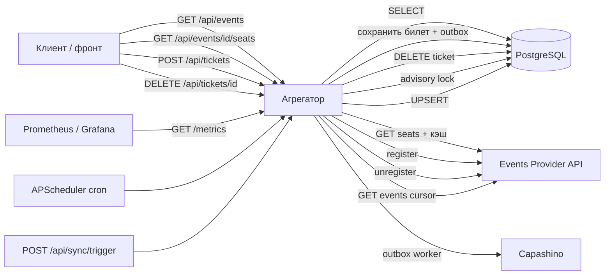

# Events API Aggregator Service

Backend-сервис-агрегатор для [Events Provider API](http://events-provider.dev-2.python-labs.ru). Кэширует события в PostgreSQL, проксирует регистрации и места к провайдеру, отправляет уведомления в Capashino через outbox.

**Деплой (LMS):** https://avegeorges-events-aggregator.dev-2.python-labs.ru  
**Grafana:** https://grafana.dev-2.python-labs.ru/d/avegeorges-avegeorges-events-aggregator/avegeorges-events-aggregator

## Структура API

Роуты вынесены в `app/api/v1/`:

```
app/api/v1/
├── health.py    # GET /api/health
├── events.py    # GET /api/events, GET /api/events/{event_id}, GET .../seats
├── tickets.py   # POST /api/tickets, DELETE /api/tickets/{ticket_id}
├── sync.py      # POST /api/sync/trigger
└── router.py    # сборка v1-роутеров
```

Дополнительно:

- `app/api/metrics.py` — `GET /metrics` (Prometheus)
- `app/api/middleware.py` — HTTP-метрики, `X-Request-ID`
- `app/integrations/events_provider/` — HTTP-клиент Events Provider
- `app/integrations/capashino/` — HTTP-клиент Capashino (уведомления)
- `app/services/outbox_worker.py` — фоновая доставка outbox → Capashino
- `app/core/metrics.py` — определения метрик Prometheus

Точка входа: `app/main.py` (`create_app`, `lifespan`, middleware).

## Endpoints

| Метод | Путь | Описание |
|-------|------|----------|
| GET | `/api/health` | Проверка доступности сервиса |
| GET | `/api/events` | Список событий из БД (`date_from`, `page`, `page_size`) |
| GET | `/api/events/{event_id}` | Детали события с полной информацией о площадке |
| GET | `/api/events/{event_id}/seats` | Свободные места (провайдер + in-memory кэш) |
| POST | `/api/tickets` | Регистрация на событие (провайдер + БД + outbox на уведомление) |
| DELETE | `/api/tickets/{ticket_id}` | Отмена билета (провайдер + удаление из `tickets`) |
| POST | `/api/sync/trigger` | Ручной запуск синхронизации (409, если sync уже идёт) |
| GET | `/metrics` | Метрики Prometheus (без авторизации) |

Swagger UI: `/docs`

## Наблюдаемость (Prometheus + Grafana)

Эндпоинт `GET /metrics` отдаёт метрики в формате Prometheus (`prometheus-client`). Prometheus на LMS скрейпит его автоматически.

| Метрика | Тип | Описание |
|---------|-----|----------|
| `http_requests_total` | Counter | Входящие HTTP-запросы (`method`, `endpoint`, `status`) |
| `http_request_duration_seconds` | Histogram | Latency входящих запросов |
| `events_provider_requests_total` | Counter | Исходящие запросы к Events Provider |
| `events_provider_request_duration_seconds` | Histogram | Latency Events Provider |
| `tickets_created_total` | Gauge | Текущее число билетов в БД |
| `tickets_cancelled_total` | Gauge | Отменённые билеты (при удалении из БД — 0) |
| `events_total` | Gauge | Текущее число событий в БД |
| `cache_hits_total` / `cache_misses_total` | Counter | Эффективность кэша свободных мест |

HTTP-метрики собираются через `MetricsMiddleware`; бизнес-Gauge обновляются из БД при каждом вызове `/metrics`.

Дашборд Grafana: [avegeorges-events-aggregator](https://grafana.dev-2.python-labs.ru/d/avegeorges-avegeorges-events-aggregator/avegeorges-events-aggregator)

Ошибки в production также уходят в GlitchTip (`GLITCHTIP_DSN` / `SENTRY_DSN`).

## Уведомления (outbox → Capashino)

При успешной регистрации билета (`POST /api/tickets`) в таблицу `outbox` пишется событие `TICKET_PURCHASED`. Фоновый воркер (`OUTBOX_WORKER_ENABLED`, интервал `OUTBOX_POLL_INTERVAL_SECONDS`) отправляет уведомление в [Capashino](http://capashino.dev-2.python-labs.ru) через `POST /api/notifications` с `reference_id` = `ticket_id`.

При отмене билета запись удаляется из outbox. Повторная доставка при сбоях — через retry воркера; `409 Conflict` от Capashino считается успехом.

## Синхронизация событий

События попадают в PostgreSQL двумя способами:

| Способ | Когда |
|--------|--------|
| **Cron** | Каждый день в `SYNC_CRON_HOUR:SYNC_CRON_MINUTE` (`SYNC_CRON_TIMEZONE`, по умолчанию 03:00 UTC) |
| **POST /api/sync/trigger** | Вручную или автотесты LMS |

Оба пути используют `run_sync_with_lock` и **PostgreSQL advisory lock** (`pg_try_advisory_lock`) — при нескольких pod'ах в k8s sync выполняет только один процесс. Остальные cron-запуски пропускаются с записью в лог; повторный trigger возвращает **409** `sync_already_running`.

Отключить фоновый cron: `SYNC_CRON_ENABLED=false` (остаётся только ручной trigger).

## Локальный запуск

```bash
cp .env.example .env
uv sync --group dev
uv run uvicorn app.main:app --reload
```

- Health: http://localhost:8000/api/health
- Events: http://localhost:8000/api/events?page=1&page_size=20
- Metrics: http://localhost:8000/metrics
- Docs: http://localhost:8000/docs

## Тесты и линтер

### Локально (PostgreSQL через Docker)

```bash
docker compose up -d db
uv sync --group dev
uv run alembic upgrade head
uv run ruff check .
uv run pytest -q
```

### Все тесты в Docker-контейнере

```bash
docker compose build app
docker compose up -d db
docker compose --profile test run --rm test
```

Сервис `test` применяет миграции, ставит dev-зависимости и запускает pytest с `POSTGRES_HOST=db`.

Линтер в контейнере:

```bash
docker compose run --rm --entrypoint="" app sh -c "uv sync --group dev && uv run ruff check ."
```

## Переменные окружения

См. `.env.example`. Ключевые группы:

- `LOG_*` — формат и вывод логов (JSON в stdout на LMS)
- `POSTGRES_*` — PostgreSQL (на LMS задаёт платформа)
- `EVENTS_PROVIDER_*` — URL и API-ключ провайдера
- `CAPASHINO_*` — URL и API-ключ Capashino (уведомления)
- `OUTBOX_*` — фоновый воркер outbox
- `GLITCHTIP_DSN` / `SENTRY_DSN` — мониторинг ошибок
- `SEATS_CACHE_TTL_SECONDS` — TTL in-memory кэша свободных мест (по умолчанию 30)
- `SYNC_CRON_*` — фоновая синхронизация (APScheduler в `lifespan`):

| Переменная | По умолчанию | Описание |
|------------|--------------|----------|
| `SYNC_CRON_ENABLED` | `true` | Включить ежедневный cron |
| `SYNC_CRON_HOUR` | `3` | Час запуска |
| `SYNC_CRON_MINUTE` | `0` | Минута запуска |
| `SYNC_CRON_TIMEZONE` | `UTC` | Таймзона расписания |
| `OUTBOX_WORKER_ENABLED` | `true` | Включить воркер outbox |
| `OUTBOX_POLL_INTERVAL_SECONDS` | `10` | Интервал опроса outbox |

**LMS (внутренние URL в кластере):**

| Сервис | URL |
|--------|-----|
| Events Provider | `http://student-system-events-provider-web.student-system-events-provider.svc:8000` |
| Capashino | `http://student-system-capashino-web.student-system-capashino.svc:8000` |

Локально — публичные URL из `.env.example`. Значения `*_API_KEY` и `*_BASE_URL` задавайте **без пробелов** в начале и конце строки.

## CI/CD

Push в `main` → GitHub Actions: `ruff` → build образа → deploy на LMS.

Секрет репозитория: `LMS_API_KEY` (только для деплоя, не в `.env` приложения).

## Схема потоков данных


