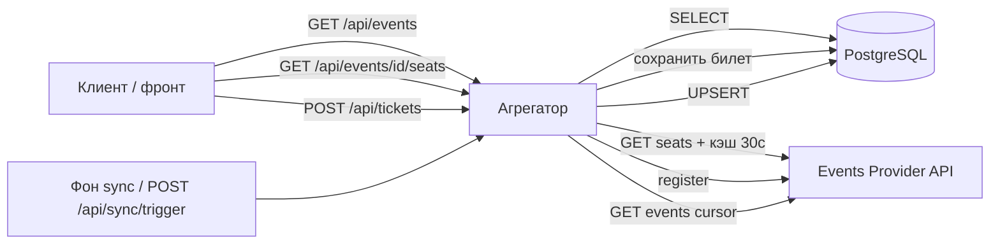

# Events API Aggregator Service

Backend-сервис-агрегатор для [Events Provider API](http://events-provider.dev-2.python-labs.ru). Кэширует события в PostgreSQL, проксирует регистрации и места к провайдеру.

## Структура API

Роуты вынесены в `app/api/v1/`:

```
app/api/v1/
├── health.py    # GET /api/health
├── events.py    # GET /api/events, GET /api/events/{event_id}, GET .../seats
├── sync.py      # POST /api/sync/trigger
└── router.py    # сборка v1-роутеров
```

Точка входа: `app/main.py` (`create_app`, `lifespan`, middleware).

Интеграция с Events Provider: `app/integrations/events_provider/` (HTTP-клиент, схемы провайдера).

## Endpoints (текущее состояние)

| Метод | Путь | Описание |
|-------|------|----------|
| GET | `/api/health` | Проверка доступности сервиса |
| GET | `/api/events` | Список событий из БД (`date_from`, `page`, `page_size`) |
| GET | `/api/events/{event_id}` | Детали события с полной информацией о площадке |
| GET | `/api/events/{event_id}/seats` | Свободные места (провайдер + кэш `SEATS_CACHE_TTL_SECONDS`) |
| POST | `/api/sync/trigger` | Ручной запуск синхронизации с Events Provider |

Swagger UI: `/docs`

## Локальный запуск

```bash
cp .env.example .env
uv sync --group dev
uv run uvicorn app.main:app --reload
```

- Health: http://localhost:8000/api/health
- Events: http://localhost:8000/api/events?page=1&page_size=20
- Docs: http://localhost:8000/docs

## Тесты и линтер

```bash
uv run ruff check .
uv run pytest -q
```

## Переменные окружения

См. `.env.example`. Ключевые группы:

- `LOG_*` — формат и вывод логов
- `POSTGRES_*` — PostgreSQL (шаг 2; на LMS задаёт платформа)
- `EVENTS_PROVIDER_*` — URL и API-ключ провайдера
- `SEATS_CACHE_TTL_SECONDS` — TTL in-memory кэша свободных мест (по умолчанию 30)
- `SYNC_CRON_*` — расписание фоновой синхронизации (шаг 5)

**LMS:** для агрегатора в кластере задайте внутренний URL провайдера:

`http://student-system-events-provider-web.student-system-events-provider.svc:8000`

Локально — публичный `http://events-provider.dev-2.python-labs.ru`.

## CI/CD

Push в `main` → GitHub Actions: `ruff` → build образа → deploy на LMS.

Секрет репозитория: `LMS_API_KEY` (только для деплоя, не в `.env` приложения).

## Схема Read-path / write-path


